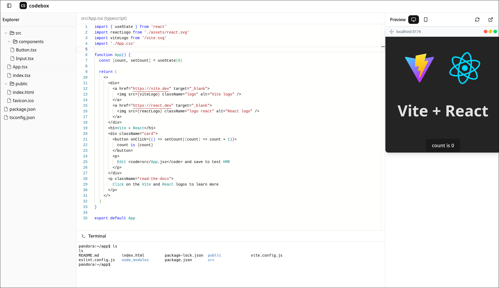

# codebox

<details>
    <summary>Screenshot</summary>
    
</details>

### Usage
 clone the repository:

   ```shell
   git clone https://github.com/snickpick/codebox.git
   ```
### Client
   ```shell
   cd client
   npm install
   npm run dev
   ```
### Building the docker image
   ```shell
   cd server
   docker build -t codebox-image .
   ```
### Server
   ```shell
   cd server
   npm install
   npm run dev
   ``````
